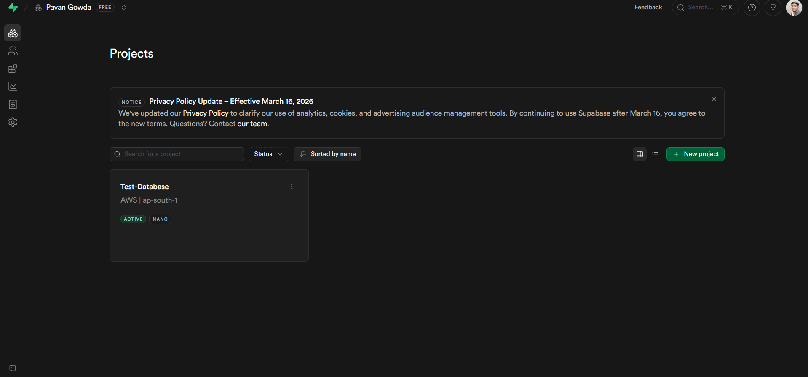
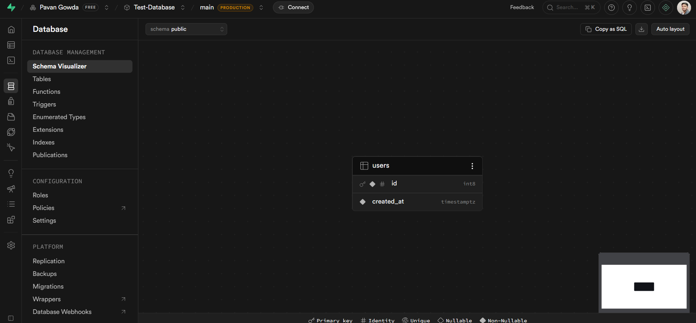
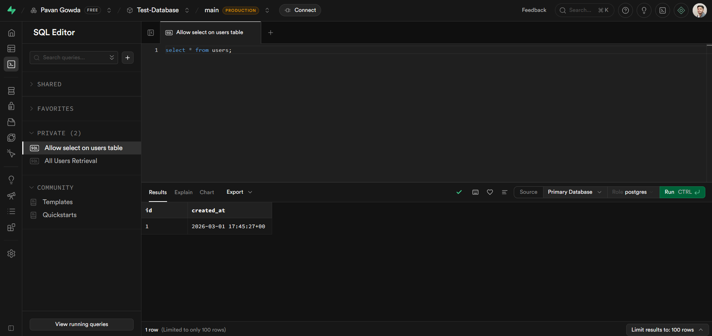
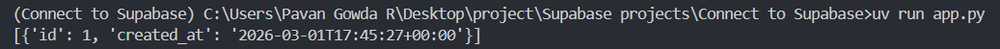

# 🔗 Connect to Supabase using Python

A step-by-step guide and working Python project demonstrating how to connect to a **Supabase** PostgreSQL database, create tables, configure Row Level Security (RLS) policies, and query data using the official Supabase Python client.

---

## 📸 Screenshots

### Supabase Project Dashboard


### Table Created in Supabase


### SQL Editor — Query Result


### Python Output


---

## 🧰 Tech Stack

| Technology | Purpose |
|---|---|
| [Supabase](https://supabase.com/) | Backend as a Service — PostgreSQL database |
| [Python 3.12](https://www.python.org/) | Runtime (3.14 not yet compatible with Supabase) |
| [uv](https://github.com/astral-sh/uv) | Fast Python package and project manager |
| [supabase-py](https://github.com/supabase/supabase-py) | Official Supabase Python client |
| [python-dotenv](https://pypi.org/project/python-dotenv/) | Load credentials from `.env` file |

---

## 📋 Step 1 — Create a Supabase Project

1. Go to [supabase.com](https://supabase.com) and log in with your **GitHub** account
2. Click **New Project**
3. Fill in the details:
   - **Organization Name** — your GitHub org or personal account
   - **Project Name** — e.g. `Test-Database`
   - **Database Password** — click **Generate** or enter manually
4. Click **Create new project** and wait for it to provision

---

## 🗃️ Step 2 — Create a Table

1. In the left sidebar, click **Database**
2. Click **Create new table**
3. Fill in:
   - **Name** — e.g. `users`
   - **Description** — optional
4. Scroll down to **Columns** — you can use the default columns (`id`, `created_at`) or add your own
5. Click **Save**

### Verify the table in the SQL Editor

In the left sidebar click **SQL Editor** and run:

```sql
select * from users;
```

> You should see an empty table with your column headers — this confirms the table was created successfully.

---

## 💻 Step 3 — Set Up the Python Project

### Create the project folder

```bash
mkdir supabase-python
cd supabase-python
```

### Initialize with `uv`

```bash
uv init
```

### Install dependencies

```bash
uv add python-dotenv supabase
```

> ⚠️ **Important:** Python 3.14 is **not compatible** with the Supabase client. Use Python 3.12.

### Pin Python version to 3.12

In `pyproject.toml`, update the Python requirement:

```toml
requires-python = ">=3.10, <3.14"
```

Then run:

```bash
uv python pin 3.12
uv venv --clear --python 3.12
uv add supabase
```

### Verify the installation

```bash
uv run python -c "import supabase; print('OK')"
```

You should see `OK` printed in the terminal.

### Set the Python interpreter in VS Code

1. Press `Ctrl + Shift + P`
2. Search: **Python: Select Interpreter**
3. Choose: `.venv\Scripts\python.exe`
4. Reload VS Code: `Ctrl + Shift + P` → **Reload Window**

---

## 🔑 Step 4 — Add Supabase Credentials

Create a `.env` file in the project root:

```env
SUPABASE_URL=https://your-project-id.supabase.co
SUPABASE_KEY=your-anon-public-key
```

### Where to find these values

In your Supabase project:
- Go to **Project Settings → API**
- Copy the **Project URL** → `SUPABASE_URL`
- Copy the **anon / public** key → `SUPABASE_KEY`

> ⚠️ Never commit your `.env` file to GitHub. Add it to `.gitignore`.

---

## 🐍 Step 5 — Connect and Query

Create a file `main.py`:

```python
from supabase import create_client, Client
from dotenv import load_dotenv
import os

load_dotenv()

url = os.getenv("SUPABASE_URL")
key = os.getenv("SUPABASE_KEY")

supabase: Client = create_client(url, key)

try:
    response = supabase.table("users").select("*").execute()
    print(response.data)
except Exception as e:
    print(e)
```

Run it:

```bash
uv run python main.py
```

### First run output

```
[]
```

> This is expected! The table exists but is empty, and more importantly — Supabase **blocks all access by default** through Row Level Security (RLS). See Step 6 to fix this.

---

## 🛡️ Step 6 — Configure Row Level Security (RLS)

Supabase enables **Row Level Security** on all tables by default. This means even public read access must be explicitly allowed through a **policy**.

Without a policy, your Python client will return an empty list `[]` even if the table has data.

### Create a read policy

In the **SQL Editor**, run:

```sql
create policy "Allow select for all"
on public.users
for select
using (true);
```

This allows anyone with the anon key to read rows from the `users` table.

### Run the Python file again

```bash
uv run python main.py
```

You will now see your table data printed in the terminal.

---

## 📁 Project Structure

```
supabase-python/
│
├── main.py           # Python script to connect and query Supabase
├── .env              # Supabase credentials (never commit this)
├── .gitignore
├── pyproject.toml    # uv project config with Python version constraint
└── README.md
```

---

## 🙈 `.gitignore`

```
.env
.venv/
__pycache__/
```

---

## ❓ Troubleshooting

| Problem | Fix |
|---|---|
| `import supabase` fails | Make sure you selected `.venv\Scripts\python.exe` as the interpreter in VS Code |
| Output is `[]` even with data | You need to create an RLS policy — see Step 6 |
| Python 3.14 errors | Pin to Python 3.12 using `uv python pin 3.12` |
| `.env` not loading | Make sure `load_dotenv()` is called before `os.getenv()` |
| Wrong URL or key | Double-check **Project Settings → API** in Supabase |

---

## 📚 What You Learn From This Project

- Setting up a cloud PostgreSQL database with Supabase
- Managing Python versions and virtual environments using `uv`
- Connecting to Supabase from Python using the official client
- Understanding Row Level Security (RLS) and why it matters
- Loading secrets securely with `python-dotenv`
- Querying database tables using the Supabase Python SDK