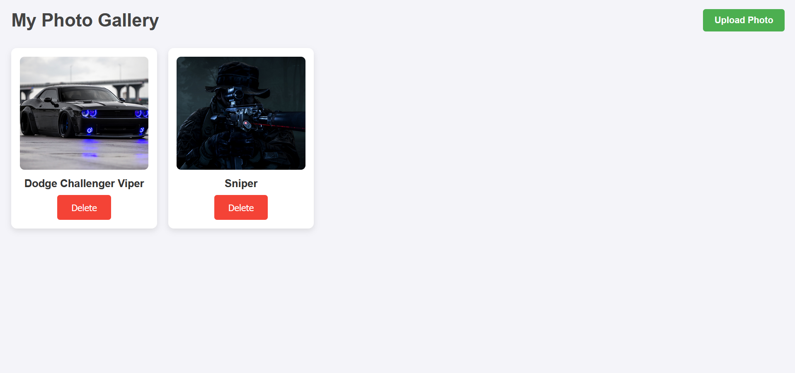
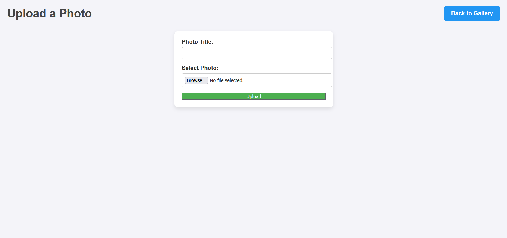
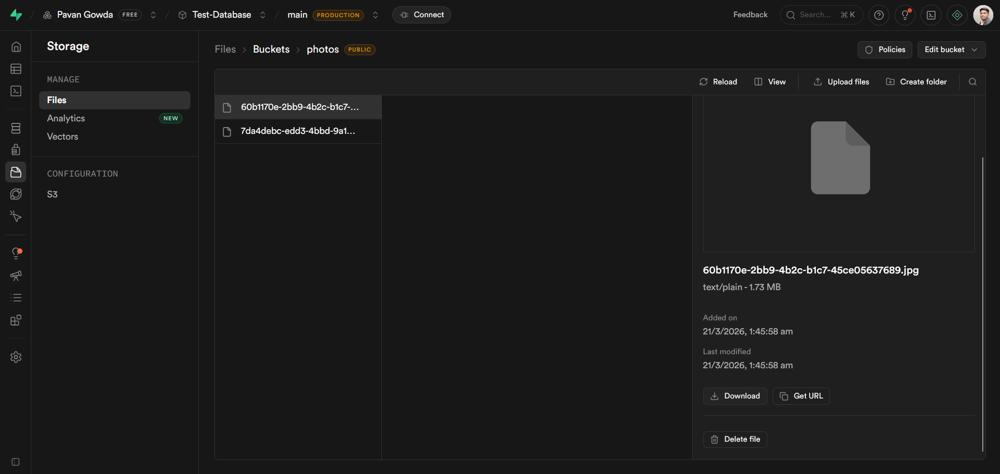
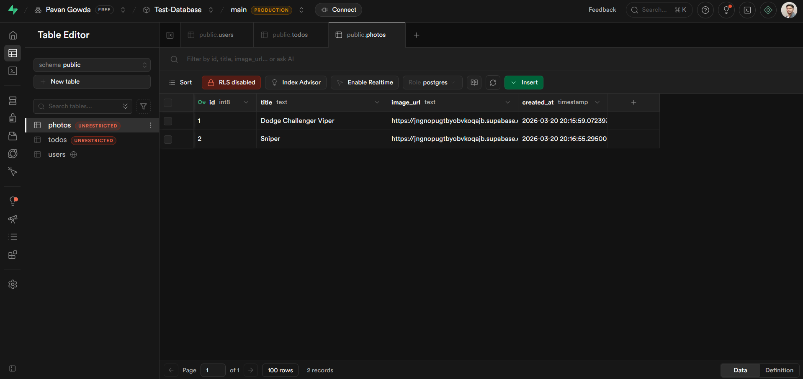

# 📸 Photo Gallery App — FastAPI & Supabase

A full-stack **photo sharing application** built with FastAPI and Supabase. Upload photos, store them in Supabase Storage, save metadata to a PostgreSQL database, and display them in a clean gallery — all with delete support.

---

## 📸 Screenshots

### Gallery Page


### Upload Page


### Supabase Storage — photos bucket

> 📸 **Image needed:** Screenshot of the Supabase Storage bucket showing uploaded image files.

### Supabase Table — photos


---

## ✨ Features

- 📤 **Upload Photos** — upload images with a title via a simple form
- 🖼️ **Gallery View** — view all uploaded photos in a responsive grid
- 🗑️ **Delete Photos** — delete a photo from both storage and the database
- ☁️ **Cloud Storage** — images stored in Supabase Storage (public bucket)
- 🗃️ **PostgreSQL Database** — photo metadata stored in Supabase
- 🔗 **Public URLs** — each image gets a permanent public URL

---

## 🧰 Tech Stack

| Technology | Purpose |
|---|---|
| [FastAPI](https://fastapi.tiangolo.com/) | Web framework |
| [Supabase](https://supabase.com/) | PostgreSQL database + file storage |
| [supabase-py](https://github.com/supabase/supabase-py) | Supabase Python client |
| [Jinja2](https://jinja.palletsprojects.com/) | HTML templating |
| [python-dotenv](https://pypi.org/project/python-dotenv/) | Load credentials from `.env` |
| [uv](https://github.com/astral-sh/uv) | Fast Python package manager |

---

## 📁 Project Structure

```
photo-gallery/
│
├── main.py                  # FastAPI app — routes and Supabase logic
│
├── templates/
│     ├── index.html         # Gallery page
│     └── upload.html        # Upload form page
│
├── static/
│     └── style.css          # Stylesheet for all pages
│
├── .env                     # Supabase credentials (never commit this)
├── .gitignore
└── pyproject.toml           # uv project config
```

---

## ⚙️ Setup

### 1. Create the project folder and initialize

```bash
mkdir photo-gallery
cd photo-gallery
uv init
```

### 2. Install dependencies

```bash
uv add python-dotenv supabase fastapi "uvicorn[standard]" python-multipart jinja2
```

### 3. Set up your `.env` file

Create a `.env` file in the project root:

```env
SUPABASE_URL=https://your-project-id.supabase.co
SUPABASE_KEY=your-anon-public-key
```

**Where to find these:**
- Go to your Supabase project → **Project Settings → API**
- Copy **Project URL** → `SUPABASE_URL`
- Copy **anon / public** key → `SUPABASE_KEY`

> ⚠️ Never commit your `.env` to GitHub. It is already covered by `.gitignore`.

---

## 🗃️ Step 4 — Create the Database Table

In your Supabase project go to **SQL Editor** and run:

```sql
CREATE TABLE photos (
  id         BIGINT GENERATED BY DEFAULT AS IDENTITY PRIMARY KEY,
  title      TEXT NOT NULL,
  image_url  TEXT NOT NULL,
  created_at TIMESTAMP DEFAULT NOW()
);
```

This creates a `photos` table with four columns — an auto-incrementing `id`, a `title`, the `image_url` from Supabase Storage, and a `created_at` timestamp.

### Enable RLS policies

Supabase blocks all access by default. Run these in the SQL Editor:

```sql
-- Allow anyone to read photos
CREATE POLICY "Allow select for all"
ON public.photos FOR SELECT
USING (true);

-- Allow anyone to insert photos
CREATE POLICY "Allow insert for all"
ON public.photos FOR INSERT
WITH CHECK (true);

-- Allow anyone to delete photos
CREATE POLICY "Allow delete for all"
ON public.photos FOR DELETE
USING (true);
```

---

## 🪣 Step 5 — Create the Storage Bucket

1. In your Supabase project go to **Storage** in the left sidebar
2. Click **New Bucket**
3. Enter the name: `photos`
4. Toggle **Public bucket** to ON
5. Click **Create bucket**

> The bucket must be public so that image URLs are accessible without authentication.

---

## 🐍 Application Code

### `main.py`

```python
from fastapi import FastAPI, Request, UploadFile, Form, HTTPException
from fastapi.responses import HTMLResponse, RedirectResponse
from fastapi.staticfiles import StaticFiles
from fastapi.templating import Jinja2Templates
from supabase import create_client
import os
from dotenv import load_dotenv
import uuid

load_dotenv()

SUPABASE_URL = os.getenv("SUPABASE_URL")
SUPABASE_KEY = os.getenv("SUPABASE_KEY")
supabase = create_client(SUPABASE_URL, SUPABASE_KEY)

app = FastAPI()
app.mount("/static", StaticFiles(directory="static"), name="static")
templates = Jinja2Templates(directory="templates")

BUCKET_NAME = "photos"


# Gallery page
@app.get("/", response_class=HTMLResponse)
def gallery(request: Request):
    data = supabase.table("photos").select("*").execute().data
    return templates.TemplateResponse("index.html", {"request": request, "photos": data})


# Upload form page
@app.get("/upload", response_class=HTMLResponse)
def upload_form(request: Request):
    return templates.TemplateResponse("upload.html", {"request": request})


# Handle file upload
@app.post("/upload")
async def upload_photo(title: str = Form(...), file: UploadFile = Form(...)):
    try:
        ext = file.filename.split(".")[-1]
        filename = f"{uuid.uuid4()}.{ext}"
        contents = await file.read()

        supabase.storage.from_(BUCKET_NAME).upload(filename, contents)
        public_url = supabase.storage.from_(BUCKET_NAME).get_public_url(filename)
        supabase.table("photos").insert({"title": title, "image_url": public_url}).execute()

        return RedirectResponse("/", status_code=303)
    except Exception as e:
        raise HTTPException(status_code=500, detail=str(e))


# Delete photo
@app.post("/delete/{photo_id}")
def delete_photo(photo_id: int):
    data = supabase.table("photos").select("*").eq("id", photo_id).execute().data
    if not data:
        raise HTTPException(status_code=404, detail="Photo not found")

    photo = data[0]
    filename = photo["image_url"].split("/")[-1]
    supabase.storage.from_(BUCKET_NAME).remove([filename])
    supabase.table("photos").delete().eq("id", photo_id).execute()

    return RedirectResponse("/", status_code=303)
```

---

## ▶️ Run the App

```bash
python -m uvicorn main:app --reload
```

Open: [http://127.0.0.1:8000](http://127.0.0.1:8000)

---

## 🛣️ Routes

| Method | Route | Description |
|--------|-------|-------------|
| GET | `/` | Gallery — view all uploaded photos |
| GET | `/upload` | Upload form page |
| POST | `/upload` | Handle photo upload |
| POST | `/delete/{id}` | Delete a photo by ID |

---

## 🙈 `.gitignore`

```
.env
.venv/
__pycache__/
```

---

## ❓ Troubleshooting

| Problem | Fix |
|---|---|
| Images not showing | Make sure the bucket is set to **public** in Supabase Storage |
| Upload fails | Check that `python-multipart` is installed — required for form file uploads |
| Empty gallery | Add RLS select and insert policies in the SQL Editor |
| Delete not working | Add the RLS delete policy in the SQL Editor |
| `.env` not loading | Ensure `load_dotenv()` is called before `os.getenv()` |

---

## 📚 What You Learn From This Project

- Building a full-stack app with FastAPI and Jinja2 templates
- Uploading files from a web form using `UploadFile`
- Storing files in Supabase Storage and getting public URLs
- Saving and querying metadata in a Supabase PostgreSQL table
- Performing delete operations across both storage and database
- Generating unique filenames with `uuid` to avoid collisions
- Managing RLS policies for read, insert, and delete access