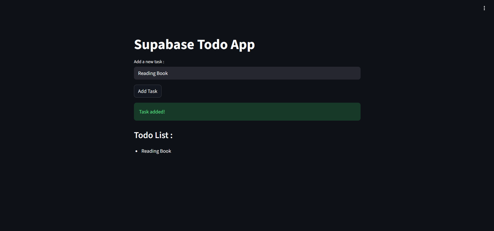
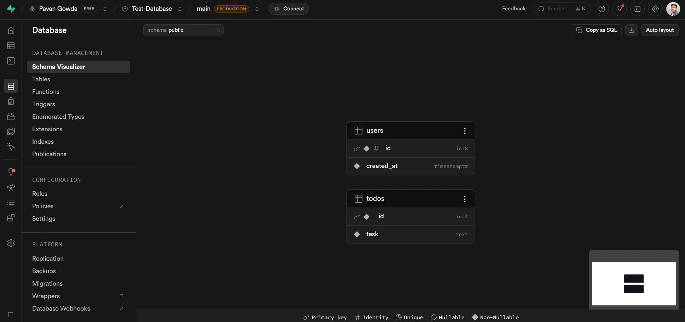
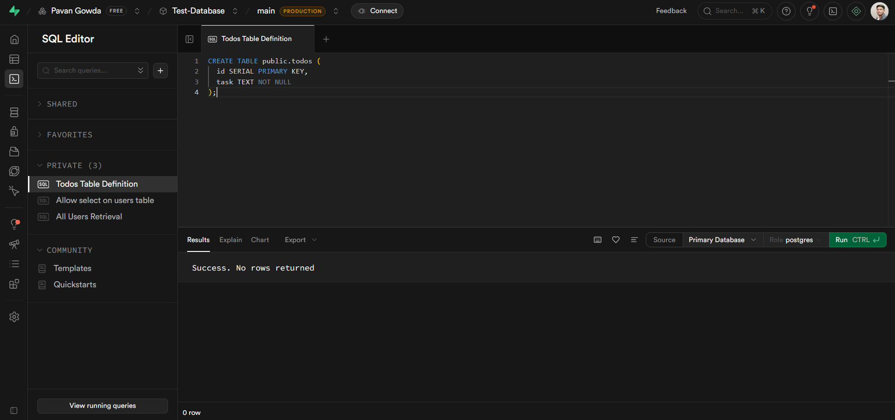

# To Do App — Python, Streamlit & Supabase

A simple full-stack **To Do application** built with Streamlit for the UI and Supabase as the backend database. Add tasks, store them in the cloud, and view them in real time — all in under 50 lines of Python.

---

## 📸 Screenshots

### App Running in Browser


### Supabase Table — todos


### SQL Editor — Table Creation


---

## 🧰 Tech Stack

| Technology | Purpose |
|---|---|
| [Python 3.12](https://www.python.org/) | Runtime |
| [Streamlit](https://streamlit.io/) | Frontend UI framework |
| [Supabase](https://supabase.com/) | Cloud PostgreSQL database |
| [supabase-py](https://github.com/supabase/supabase-py) | Official Supabase Python client |
| [python-dotenv](https://pypi.org/project/python-dotenv/) | Load credentials from `.env` |
| [uv](https://github.com/astral-sh/uv) | Fast Python package manager |

---

## 📁 Project Structure

```
todo-app/
│
├── main.py           # Streamlit app — UI and Supabase logic
├── .env              # Supabase credentials (never commit this)
├── .gitignore
├── pyproject.toml    # uv project config
└── README.md
```

---

## ⚙️ Setup

### 1. Open the folder in VS Code and initialize the project

```bash
uv init
```

### 2. Install dependencies

```bash
uv add streamlit python-dotenv supabase
```

> ⚠️ Python 3.14 is not compatible with the Supabase client. Use Python 3.12.

```bash
uv python pin 3.12
uv venv --clear --python 3.12
```

### 3. Activate the virtual environment

```bash
# macOS / Linux
source .venv/bin/activate

# Windows
.venv\Scripts\activate
```

### 4. Set up your `.env` file

Create a `.env` file in the project root:

```env
SUPABASE_URL=https://your-project-id.supabase.co
SUPABASE_KEY=your-anon-public-key
```

**Where to find these values:**
- Go to your Supabase project → **Project Settings → API**
- Copy **Project URL** → `SUPABASE_URL`
- Copy **anon / public** key → `SUPABASE_KEY`

> ⚠️ Never commit your `.env` file. It is already covered by `.gitignore`.

---

## 🗃️ Step 5 — Create the Table in Supabase

In your Supabase project go to **SQL Editor** and run:

```sql
CREATE TABLE public.todos (
  id   SERIAL PRIMARY KEY,
  task TEXT NOT NULL
);
```

This creates a `todos` table with two columns — an auto-incrementing `id` and a `task` text field.

### Enable read access with an RLS policy

Supabase blocks all access by default. Run this in the SQL Editor to allow the app to read and write data:

```sql
-- Allow anyone to read todos
CREATE POLICY "Allow select for all"
ON public.todos
FOR SELECT
USING (true);

-- Allow anyone to insert todos
CREATE POLICY "Allow insert for all"
ON public.todos
FOR INSERT
WITH CHECK (true);
```

---

## 🐍 Step 6 — Application Code

Create `main.py`:

```python
import streamlit as st
from supabase import create_client, Client
from dotenv import load_dotenv
import os

load_dotenv()

url = os.getenv("SUPABASE_URL")
key = os.getenv("SUPABASE_KEY")

supabase: Client = create_client(url, key)


def get_todos():
    response = supabase.table('todos').select("*").execute()
    return response.data


def add_todo(task):
    supabase.table('todos').insert({"task": task}).execute()


st.title("Supabase Todo App")

task = st.text_input("Add a new task:")

if st.button("Add Task"):
    if task:
        add_todo(task)
        st.success("Task added!")
    else:
        st.error("Please enter a task")

st.write("### Todo List:")

todos = get_todos()

if todos:
    for todo in todos:
        st.write(f" - {todo['task']}")
else:
    st.write("No tasks available")
```

---

## ▶️ Run the App

```bash
streamlit run main.py
```

The app will open automatically in your browser at:

```
http://localhost:8501
```

---

## 🙈 `.gitignore`

```
.env
.venv/
__pycache__/
```

---

## ❓ Troubleshooting

| Problem | Fix |
|---|---|
| `import supabase` fails | Select `.venv\Scripts\python.exe` as the interpreter in VS Code |
| Tasks not showing | Make sure you created the RLS policies in the SQL Editor |
| App doesn't start | Make sure the virtual environment is activated before running |
| `.env` not loading | Ensure `load_dotenv()` is called before `os.getenv()` |
| Wrong URL or key | Check **Project Settings → API** in your Supabase project |

---

## 📚 What You Learn From This Project

- Building a full-stack app entirely in Python with Streamlit
- Connecting Python to a cloud PostgreSQL database using Supabase
- Understanding Row Level Security (RLS) policies in Supabase
- Managing project dependencies with `uv`
- Storing credentials securely with `.env` files
- Performing basic CRUD operations with the Supabase Python SDK